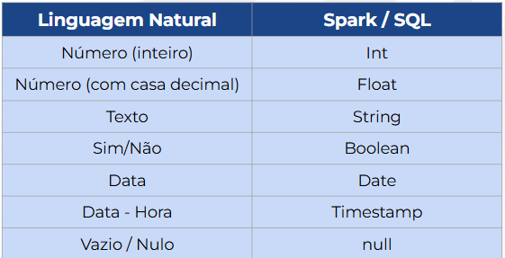

# Learning SQL

## Mas o que é SQL?

    “Structured Query Language, ou Linguagem de Consulta Estruturada ou SQL, é a linguagem de pesquisa declarativa padrão para banco de dados relacional (base de dados relacional).” - Wikipedia

    * Comandos – executados resultam em efeito persistente sobre dados e estruturas, ou controlam transações, conexões, sessões, etc. 
        • EX: SELECT, INSERT, UPDATE, DELETE, CREATE TABLE, GRANT, etc.

    • Cláusulas - componentes dos comandos. Em muitos casos, alguns são opcionais. 
        • Ex: FROM, WHERE, GROUP BY 

    • Expressões - os quais produzem tanto valores escalares, como tabelas consistindo de colunas e linhas 
        • Ex: A+B, A*ABS(B-20)

    • Predicados - especificam condições que podem ser avaliadas pela lógica, retornando verdadeiro, falso ou desconhecido
        • Ex: A>B, C BETWEEN 20 AND 200 

    • Queries - que retornam dados baseados em critérios específicos
        • Ex: SELECT COLUNA FROM TABELA

## Tipos de Dados


## Outras Estruturas Importantes
    • Chaves primárias (Primary Key) e referenciais (Foreign Key)
        • PK, FK - garantem integridade e relacionamento consistente entre tabelas
        • Servem como uma documentação também
        • Exemplos: CPF, CNPJ, ID de cliente – PKs. Colocar um ID de cliente válido num pedido - FK 

    • Constraints 
        • Assim como PKs e FKs, servem para garantir integridade
        • Não são mais muito utilizadas pois acabam onerando o SGBD
        • A mais comum é a NOT NULL

    • Sequências 
        • Servem para garantir que informações únicas sejam criadas, com continuidade e unicidade 
        • Normalmente são identificadores internos das aplicações

## SELECT
    Toda consulta de tabelas precisa ao menos de duas instruções em sua sintaxe. A primeira é a SELECT, onde é passado uma lista de colunas que se deseja obter, bem como realizar a criação de novas colunas e cálculos.

```sql
    SELECT ‘Olá mundo!’

    SELECT 2 * 136
```

## FROM
    Esta é a segunda instrução necessária para realizar uma consulta simples. Devemos informar a partir de qual tabela desejamos obter os dados. Assim, para selecionar todas colunas de uma tabela, temos:

```sql
SELECT *
FROM tabela
```
    Note que o * (asterisco) representa todas as colunas.

##  WHERE
    Agora que temos uma query simples, podemos adicionar algumas instruções adicionais. Talvez seja necessário realizar algum tipo de filtro, para isso utilizamos o WHERE com uma condição lógica.

```sql
SELECT *
FROM cliente
WHERE flEmail = 1
```

    Podemos ler esse código em linguagem natural da seguinte forma: “selecione todas colunas da tabela cliente onde os valores da coluna flEmail sejam iguais a 1 ”

## CASE
    Como podemos identificar se um pedido atrasou ou não? Podemos realizar comparações lógicas ao criar novas variáveis?

```sql
SELECT *,
     CASE WHEN QtdePontos > 500 THEN ‘alto’ END AS NivelPontos
FROM cliente
```

## Agregações
    Em muitos momentos desejamos alguns dados sumarizados, como por exemplo: contagem, média, variância, mínimo, máximo, etc.

    Contagem de linhas: count(*)
    Contagem de linhas distintas: count(distinct column)
    Soma: sum(column)
    Média: avg(column)
    Máximo: max(column)

## GROUP BY
    Será que temos uma forma melhor para sumarizar dados em diferentes níveis? Para isso, podemos AGREGAR os dados utilizando a instrução GROUP BY

```sql
SELECT idCliente,
    count( idTransacao )
FROM transacoes
GROUP BY idCliente
```